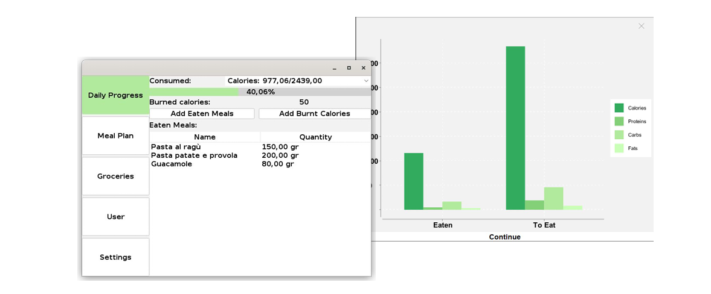
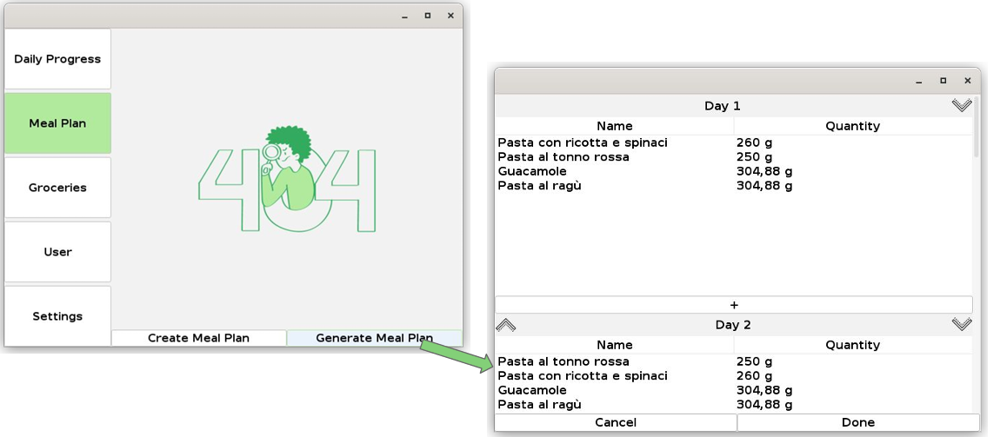
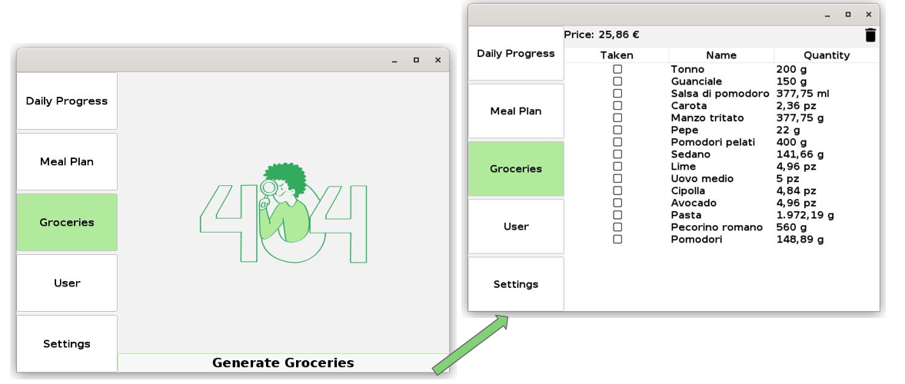

# Picky Eater App 🇮🇹 / 🇬🇧

## 🇮🇹 Italiano

**Disclaimer**: applicazione fatta per l'esame di _Programmazione ad oggetti_, nel secondo anno della facoltà triennale di _Ingegneria Informatica_ di _UniMoRe_.  

_Picky Eater_ è un'applicazione desktop che aiuta la persona a gestire una dieta nella propria quotidianità.  
Tra le varie funzioni, l'app permette di:
- Inserire, modificare e gestire gli ingredienti da utilizzare nella propria dieta.
- Inserire, modificare e gestire i pasti da utilizzare nella propria dieta.
- Aiutare a tenere traccia delle calorie bruciate e assunte durante la giornata.  
  
- Creare, modificare e gestire piani alimentari da seguire. È anche possibile generare automaticamente dei piani alimentari.  
  
- Generare una lista della spesa a partire dal piano alimentare creato.  
  

### 🛠 Tecnologie usate
- Java: codice di base.
- Java/Swing UI: per l'interfaccia grafica.
- SQL: per la gestione dei dati.

---

## 🇬🇧 English

**Disclaimer**: this application was developed as part of the _Object-Oriented Programming_ course, during the second year of the Bachelor's degree in _Computer Engineering_ at _UniMoRe_.

_Picky Eater_ is a desktop application that helps users manage their daily diet.  
Among its features, the app allows users to:
- Add, edit, and manage ingredients used in their diet.
- Add, edit, and manage meals in their diet.
- Track calories consumed and burned throughout the day.  
  
- Create, edit, and manage meal plans to follow. It is also possible to automatically generate meal plans.  
  
- Generate a grocery list based on the created meal plan.  
  

### 🛠 Technologies used
- Java: core logic.
- Java/Swing UI: for the graphical user interface.
- SQL: for data management.
